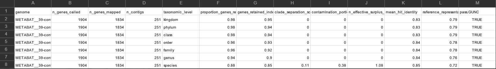

What I did today:
Today I tried to examine and improve the quality of my bins.

- MAGs quality

  -    Genome completeness:

here I want to estimate the completness and redundancy of each bin (hypothetically MAG) that I binned yesterday by MetaBat2, using: 

```
anvi-estimate-genome-completeness -c metagenomics/contigs.db -p metagenomics/fastp_out/merged_profiles/PROFILE.db -C METABAT2
```

The data also provided by report.html file on day3.

- Customizing the bins

In this step, again I entered the interactive session to open the link
 using this command: 

 ```
 anvi-interactive -p metagenomics/fastp_out/merged_profiles/PROFILE.db -c metagenomics/contigs.db -C METABAT2
 ```

 

 - Questions

 -Which binning strategy gives you the best quality for the archaea bins? 
 MetaBat2

 -How many archaea bins do you get that are of High quality? 1 archaea with 94.74% completeness and 2.63% redundancy.

 How many bacteria bins do you get that are of High quality? if we consider the 95% threshold for completeness and under 5% redundancy, I got 1 bacteria.


 - Refining archaea bins

 In this step, I copied the file MetaBat__39, to change it (refine it).

 - Detecting chimeras in MAGs by using GUNC

 Here I checked if the bins have any potential contamination (chimeras) with GUNC, using:

 ```
 gunc run -i metagenomics/fastp_out/refine_archaea39/METABAT__39/METABAT__39-contigs.fa -r $WORK/databases/gunc/gunc_db_progenomes2.1.dmnd --out_dir metagenomics/fastp_out/gunc_out --detailed_output --threads 12

 ```

 Then I run this command to visualize my results in a plot:

 ```
 gunc plot -d gunc_out/diamond_output/METABAT__39-contigs.diamond.progenomes_2.1.out -g gunc_out/gene_calls/gene_counts.json --out_dir gunc_out 

 ```

 - Questions:
  -Do you get ARCHAEA bins that are chimeric?
  based on the GUNC results, The archaeal bin does not appear to be chimeric. The contamination portion is close to zero and the bin passes the GUNC quality check(TRUE). so the genome bin shows high taxonomic consistency and low evidence of contamination.
 

 -What is chimeric bin?
 A chimeric bin is a sequence that is made from genetic material which originating from different organisms or lineages. This usually happens when contigs from different species are mistakenly grouped together during genome binning.

- Manual bin refinement
As we know large metagenome assemblies result in hundreds of bins, we want to select some of the better ones for manual refinement like more than of 70% completeness.
So I created a copy from original bin and work on it using:

```
cp metagenomics/PROFILE.db metagenomics/PROFILE_refined.db

```

Then go into the interactive session and use these commands below to work on my bins manually with anvio-refine:

```
anvi-refine -c $WORK/metagenomics/anvi_contigs/contigs.db -p refine/PROFILE_refined.db --bin-id METABAT__14 -C METABAT2 
anvi-refine -c $WORK/metagenomics/anvi_contigs/contigs.db -p refine/PROFILE_refined.db --bin-id METABAT__32 -C METABAT2 
anvi-refine -c $WORK/metagenomics/anvi_contigs/contigs.db -p refine/PROFILE_refined.db --bin-id METABAT__34 -C METABAT2 

```

.png>)

- Questions
-How much could you improve the quality of your ARCHAEA?
I couldn't improve the quality of non of them.

- Visualizing

```

anvi-interactive -p refine/PROFILE_refined.db -c $WORK/metagenomics/anvi_contigs/contigs.db -C METABAT2
```

-2.png>)

- Questions
-How abundant (relatively) are the Archaea bins (bin 34) in the 3 samples?
BGR_130305: 8.11
BGR_130527: 5.29
BGR_130708: 3.52
