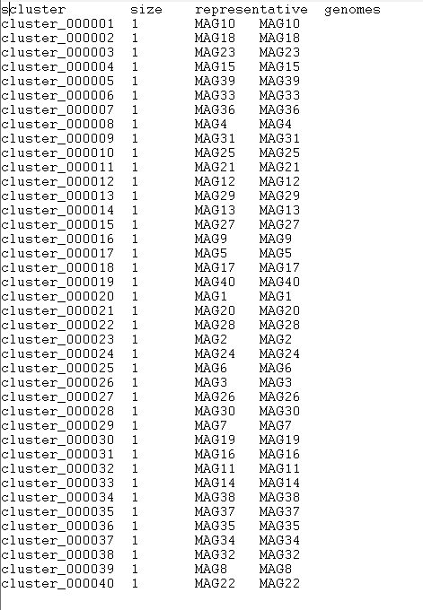
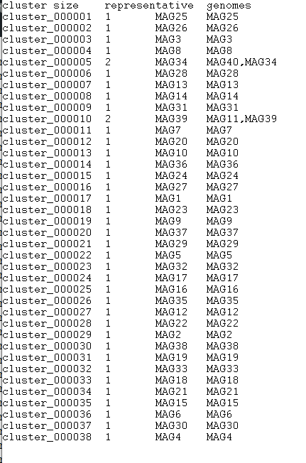

What I did today?

- Taxonomic Assignment
I added taxonomic annotations to the MAGs, using anvi-run-scg-taxonomy.

```
anvi-run-scg-taxonomy -c contigs.db -T 20 -P 2
```

This program makes quick taxonomy estimation for genomes, metagenomes, in contigs.db by using single copy core genes.

```
anvi-estimate-scg-taxonomy -c contigs.db -p $WORK/metagenomics/anvi_contigs/BGR_130305_profile/PROFILE.db --metagenome-mode --compute-scg-coverages --update-profile-db-with-taxonomy > temp_BGR_130305.txt
anvi-estimate-scg-taxonomy -c contigs.db -p $WORK/metagenomics/anvi_contigs/BGR_130527_profile/PROFILE.db --metagenome-mode --compute-scg-coverages --update-profile-db-with-taxonomy > temp_BGR_130527.txt
anvi-estimate-scg-taxonomy -c contigs.db -p $WORK/metagenomics/anvi_contigs/BGR_130708_profile/PROFILE.db --metagenome-mode --compute-scg-coverages --update-profile-db-with-taxonomy > temp_BGR_130708.txt

```

At the end, I got the summary information about my METABAT bins.

```

anvi-summarize -p $WORK/metagenomics/anvi_contigs/BGR_merge/merged_PROFILE.db -c contigs.db -o $WORK/day5/summary_metabat2 -C METABAT2

```

- Questions

-Did you get a species assignment to the ARCHAEA bins previously identified?
METABAT__11: Methanoculleus thermohydrogenotrophicum (low quality)
METABAT__39: Methanoculleus sp012797575 (high quality)
METABAT__32: Methanosarcina flavescens (low quality)

-Does the HIGH-QUALITY assignment of the bin need revision?
No, because the genome is almost complete, the taxonomy is coherent, the markers agree.

## Genome dereplication(BONUS):

First I made the table, then use the following command:

```
anvi-dereplicate-genomes -i dereplicate.csv --program fastANI --similarity-threshold 0.90 -o dereplicate90 --log-file log_ANI -T 10

```



- Questions:


-How many species do you have in the dataset?
based on the dereplication results, there are 40 clusters, and each cluster contains only one genome.
This means that none of the genomes were similar enough to be grouped together. Therefore, the dataset contains 40 species at the chosen ANI threshold.

-Try to dereplicate again at 90% identity then at 80%identity. In your own words, explain the differences between the different %identities.
hen using a higher ANI threshold (for example 90%), the dereplication is more strict. Genomes must be very similar to be grouped together, so most genomes remain in separate clusters.

When the ANI threshold is reduced (for example to 80%), the criteria become more relaxed. Genomes that are moderately similar can now be grouped into the same cluster. As a result, the number of clusters decreases and some clusters contain more than one genome.

In my dataset, after lowering the threshold, I observed that a few genomes were grouped together (for example MAG40 with MAG34, and MAG11 with MAG39), while most genomes still remained separate. This shows that only a small number of genomes have moderate similarity, and most genomes in the dataset are quite distinct from each other.



