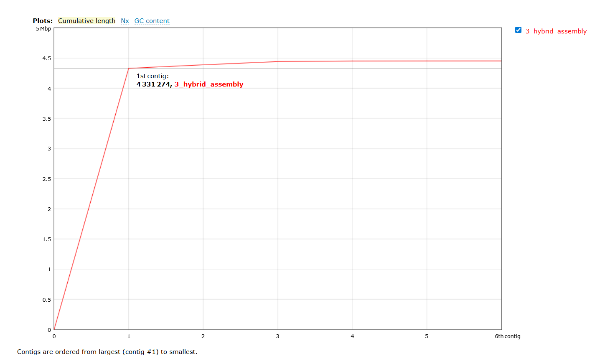
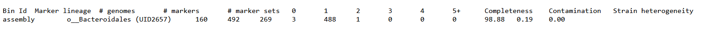
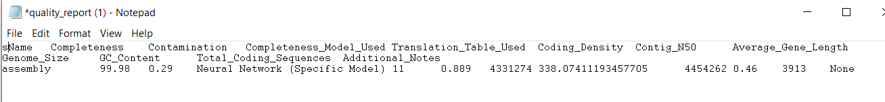

What I did today:

First go for my data in genomics and activate micromamba!

- Quality Control
So I checked the quality of long reads and short reads. To do so I Ran fastqc using:

```
for i in $WORK/genomics/0_raw_reads/short_reads/*.gz
do 
    fastqc $i -o $WORK/genomics/1_short_reads_qc/1_fastqc_raw -t 8
 done   

```

Then i ran fastp using: 

```
fastp -i 0_raw_reads/short_reads/241155E_R1.fastq.gz -o 1_short_reads_qc/1_fastqc_raw_clean/241155E_R1_clean.fastq.gz -I 0_raw_reads/short_reads/241155E_R2.fastq.gz -O 1_short_reads_qc/1_fastqc_raw_clean/241155E_R2_clean.fastq.gz -t 6 -q 25 -h 0_raw_reads/short_reads/report.html -R 0_raw_reads/short_reads/fastp_report

```

- Questions:

-How good is the read quality?
Average Phred score of 35 which Good quality
-How many reads before trimming and how many do you have now?
Before trimming 1.639.549 and after trimming 1.613.392
-Did the quality of the reads improve after trimming?
The quality improved slightly, After trimming the average Phred score is 36

- Long reads

-Nanoplot
-Filtlong

First for Nanoplot I used:

```

NanoPlot --fastq 0_raw_reads/long_reads/241155E.fastq.gz -o 0_raw_reads/long_reads/nanoplot -t 6 --maxlength 40000 --minlength 1000 --plots kde --format png --N50 --dpi 300 --store --raw --tsv_stats --info_in_report

```

Then for Filtlong:

```

filtlong --min_length 1000 --keep_percent 90 0_raw_reads/long_reads/241155E.fastq.gz | gzip > 241155E_cleaned_filtlong.fastq.gz
mv 241155E_cleaned_filtlong.fastq.gz 2_long_reads_qc/filtlong

```

Again check it with nanoplot:

```

NanoPlot --fastq 2_long_reads_qc/filtlong/241155E_cleaned_filtlong.fastq.gz -o 2_long_reads_qc/nanoplot_clean -t 6 --maxlength 40000 --minlength 1000 --plots kde --format png --N50 --dpi 300 --store --raw --tsv_stats --info_in_report

```

- Questions: 

-How good is the long reads quality?
The quality was low

-How many reads before trimming and how many do you have now?
Before trimming 15.963 and after trimming 12.446

- Using Unicycler for genome assembly

```

unicycler -1 1_short_reads_qc/1_fastqc_raw_clean/241155E_R1_clean.fastq.gz -2 1_short_reads_qc/1_fastqc_raw_clean/241155E_R2_clean.fastq.gz -l 2_long_reads_qc/filtlong/241155E_cleaned_filtlong.fastq.gz -o 3_assembly -t 24

```

Now I check the quality of my assembly using **Quast**, **CheckM**, **CheckM2**

First
- Quast

```

quast.py 3_assembly/assembly.fasta --circos -L --conserved-genes-finding --rna-finding --glimmer --use-all-alignments --report-all-metrics -o 4_assembly_qc/quast -t 8

```



- CheckM

```

mkdir -p 4_assembly_qc/checkm

checkm lineage_wf 3_assembly 4_assembly_qc/checkm -x fasta --tab_table --file 4_assembly_qc/checkm/checkm_results -r -t 8 
checkm tree_qa 4_assembly_qc/checkm 
checkm qa 4_assembly_qc/checkm/lineage.ms 4_assembly_qc/checkm/ -o 1 > 4_assembly_qc/checkm/final_table_01.csv
checkm qa 4_assembly_qc/checkm/lineage.ms 4_assembly_qc/checkm/ -o 2 > 4_assembly_qc/checkm/final_table_checkm.csv

```

- CheckM2

```

checkm2 predict --threads 1 --input 3_assembly/assembly.fasta --output-directory 4_assembly_qc/checkm2

```



- Visualization with Bandage


- Using **Prokka** to annotate the genomes

```

prokka 3_assembly/assembly.fasta --outdir 5_annotated_genome --kingdom Bacteria --addgenes --cpus 32

```

- Then Classifying the genomes using **GTDBTK** using (64 GB RAM)

```

gtdbtk classify_wf --cpus 1 --genome_dir 6_gtdb_classification --out_dir 6_gtdb_classification --extension .fna --skip_ani_screen

```

- At the end using **MultiQC**
to combine all the reports at once:

```
multiqc -d $WORK/genomics -o 7_multiqc

```

- Questions

-How good is the quality of the genome?
CheckM: completedness 99.98 and Contamination: 0.29

Quast: N50 is 1 and L50 is 4.331.274 (high quality)




-Why did we use the hybrid assembler?
we used a hybrid assembler to combine short and long reads. Short reads are very accurate but cannot resolve repeats well, while long reads can span repeats but have higher error rates. Combining both improves the assembly.

-What is the difference between short and long reads?
Short reads have higher accuracy than long reads.
Short reads are usually about 100-300 bp long but long reads are from 1kb to more than 100 kb.
Short reads perform poorly in repetitive regions and often lead to fragmented assemblies
Longer reads have higher cost per base but resolve repeats better and produce more contiguous assemblies.

-Did we use Single or Paired end reads? Why?
we used paired-end reads because they provide information from both ends of the DNA fragment and improve assembly and scaffolding compared to single-end reads.

-Which classification was assigned to the genome. Is it trust worthy and why?
The genome was classified as Bacteroides muris. It is likely trustworthy because the genome shows high completeness and low contamination.

