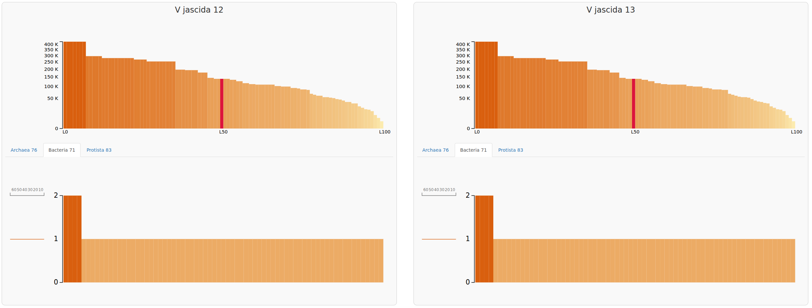
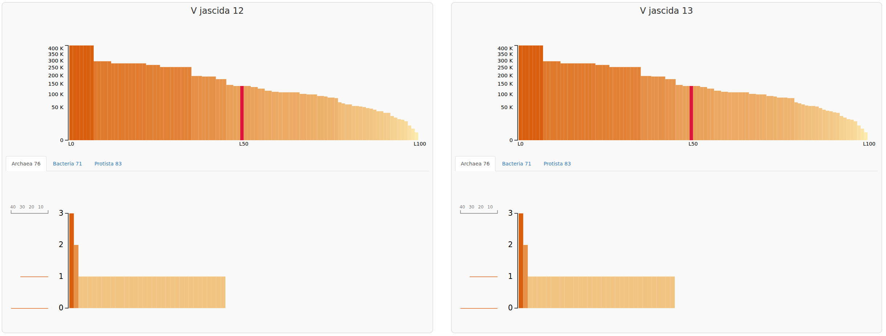
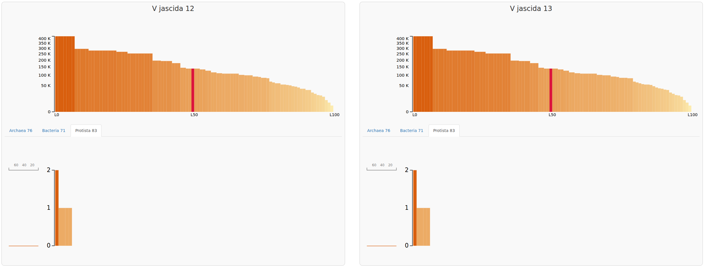
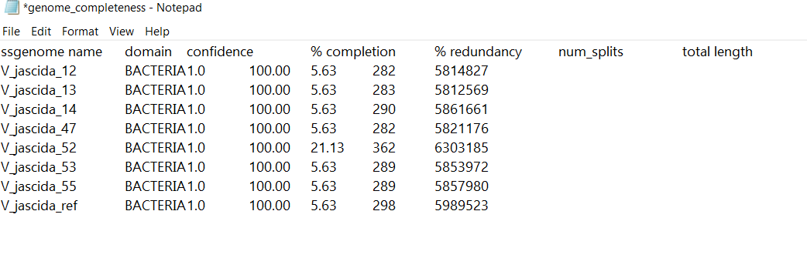
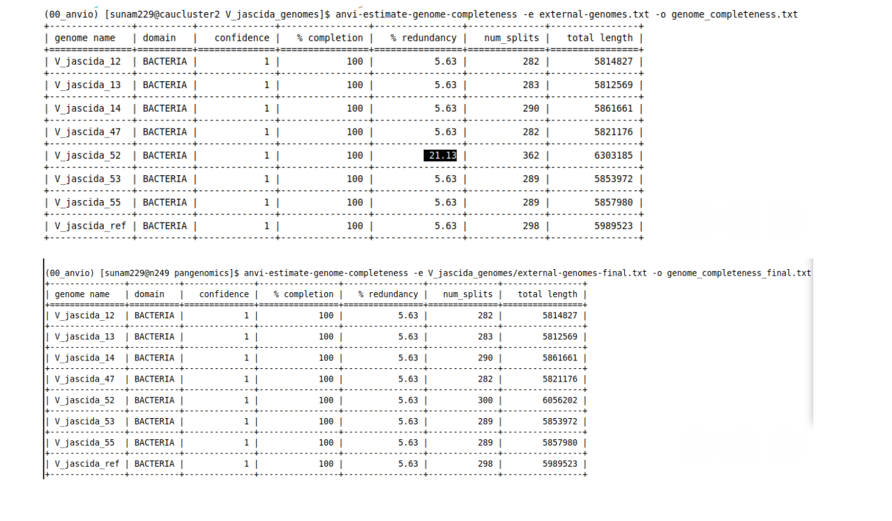

What I learned today:

Today I comapared the genomes of 52 Vibrio jasicida strains by using Anvio.
I created a pangenome and visualized it and then checked the completedness and contamination of the genomes.

- First I created a pangenomics file:

```

curl -L https://ndownloader.figshare.com/files/28965090 -o V_jascida_genomes.tar.gz
tar -zxvf V_jascida_genomes.tar.gz
ls V_jascida_genomes

```

- Then, I created contigs.db from fasta files:

```

cd $WORK/pangenomics/V_jascida_genomes
ls *fasta | awk 'BEGIN{FS="_"}{print $1}' > genomes.txt

```

-Then removed the contigs under 2500 nt:

```
for g in $(cat genomes.txt)
do 
    anvi-script-reformat-fasta ${g}_scaffolds.fasta --min-len 2500 --simplify-names -o ${g}_scaffolds_2.5k.fasta
done

```

-Then Generate contigs.db:

```

for g in $(cat genomes.txt)
do  
    anvi-gen-contigs-database -f ${g}_scaffolds_2.5k.fasta -o V_jascida_${g}.db --num-threads 4 -n V_jascida_${g}
done

```

-Annotating contigs.db

```

for g in *.db
do
    anvi-run-hmms -c $g --num-threads 4
    anvi-run-ncbi-cogs -c $g --num-threads 4
    anvi-scan-trnas -c $g --num-threads 4
    anvi-run-scg-taxonomy -c $g --num-threads 4
done

```

- Visualizing contigs.db

```
anvi-display-contigs-stats $WORK/pangenomics/V_jascida_genomes/*db

```







- Creating external genomes file

```

anvi-script-gen-genomes-file --input-dir $WORK/pangenomics/V_jascida_genomes -o external-genomes.txt

```

To check for possible contamination, we created an external genomes file. This step enables anvio to compare our genome with reference genomes and detect sequences that might not belong to the our organism.


-checking for contamination

```

anvi-estimate-genome-completeness -e external-genomes.txt

```



- Then we visualized the contigs to refine the bin manually

```

anvi-interactive -c V_jascida_52.db -p V_jascida_52/PROFILE.db

```


After removing unwanted contigs, we split and kept the high quality bins.

- Splitting the genome on our good bins

```

anvi-split -p V_jascida_52/PROFILE.db -c V_jascida_52.db -C default -o V_jascida_52_SPLIT
sed 's/V_jascida_52.db/V_jascida_52_SPLIT\/Clean\/CONTIGS.db/g' external-genomes.txt > external-genomes-final.txt

```

Finally we re estimated genome completedness to confirm that the refinement improved the genome quality.

- Estimate completedness of split and unsplit genome

```

anvi-estimate-genome-completeness -e external-genomes-final.txt -o genome_completeness.txt

```



- To compute the pangenome

-we generated a genome storage database containing all selected genomes:

```

anvi-gen-genomes-storage -e external-genomes-final.txt -o V_jascida-GENOMES.db

```

-Using this database we calculated the pangenome to identify shared and unique genes: 

```

anvi-pan-genome -g V_jascida-GENOMES.db --project-name V_jascida --num-threads 8   

```

-We then computed ANI to measure genomic similarity between the genomes:

```

anvi-compute-genome-similarity -e external-genomes-final.txt -o ani -p V_jascida/V_jascida-PAN.db  -T 8                                      

```

-Finally, the pangenome was visualized to find the relationships among the genomes.

```

anvi-display-pan -p V_jascida/V_jascida-PAN.db -g V_jascida-GENOMES.db

```


- Questions:

-Are genes clustered base on sequence similarity or functional annotation?
Genes are clustered based on sequence similarity, Functional annotation is added after clustering to help interpreting what those gene clusters might do.

-How do you spot a "bad" genome, or "bad" bin in a genome?
A bad genome or bin usually shows low completeness and high contamination. This means important genes are missing and sequences from other organisms may be mixed.

-Use the search function to assign all gene clusters into the following bins: Core genome, Accessory genome, Singletons and Single Copy core genes (SCGs). Include a screenshot of your pangenome into the protocol.

.png>)

-If you add more genomes to the pangenome, what would happen to the number of gene clusters in the Core genome and in SCGs.
when more genomes are included, the core genome usually becomes smaller because it is less likely that all genes are shared by every genome. The number of single-copy core genes also tends to decrease, since gene loss or duplication becomes more likely. At the same time, the accessory genome and singleton genes usually increase because new genomes bring additional unique genes.

-Based on the ANI, would you say all genomes belong to the same species?
Yes, the genomes can be considered the same species because the ANI values are above the common species threshold (around 95%).
