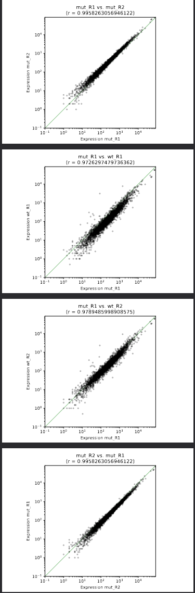
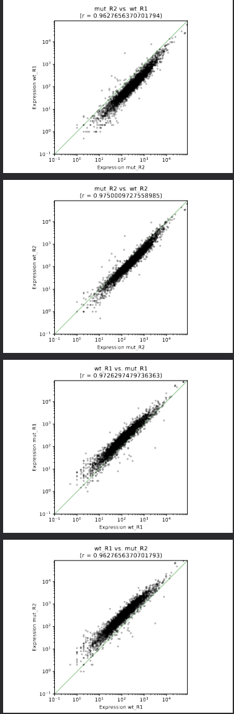
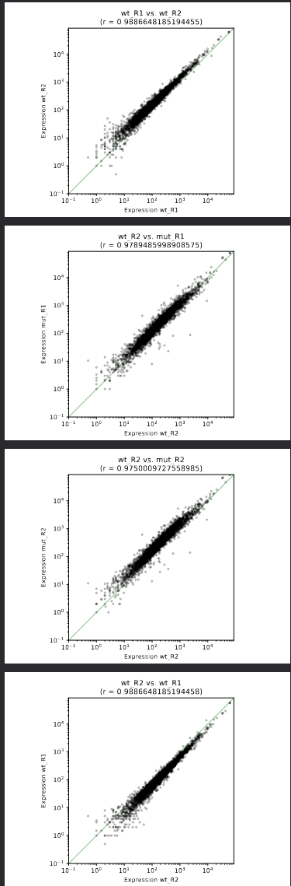
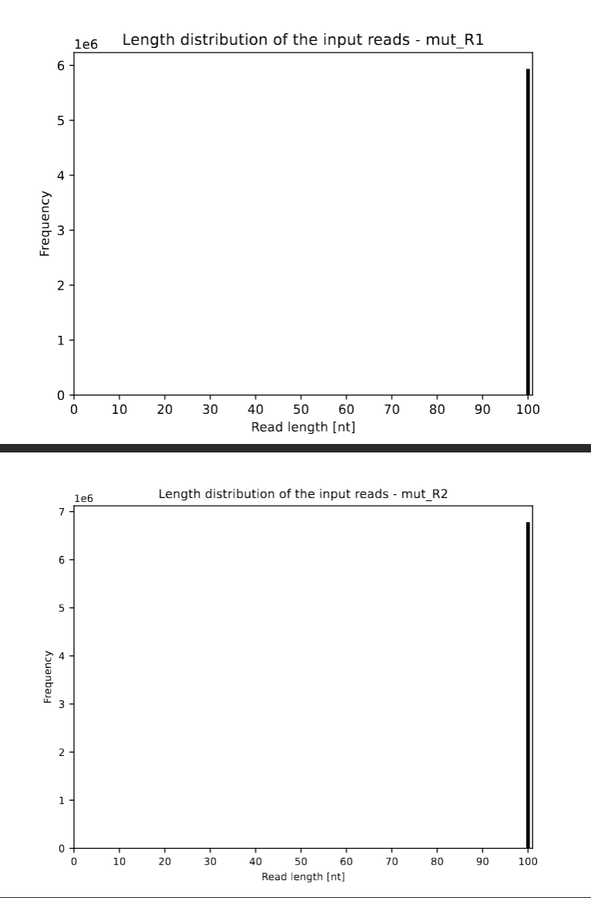
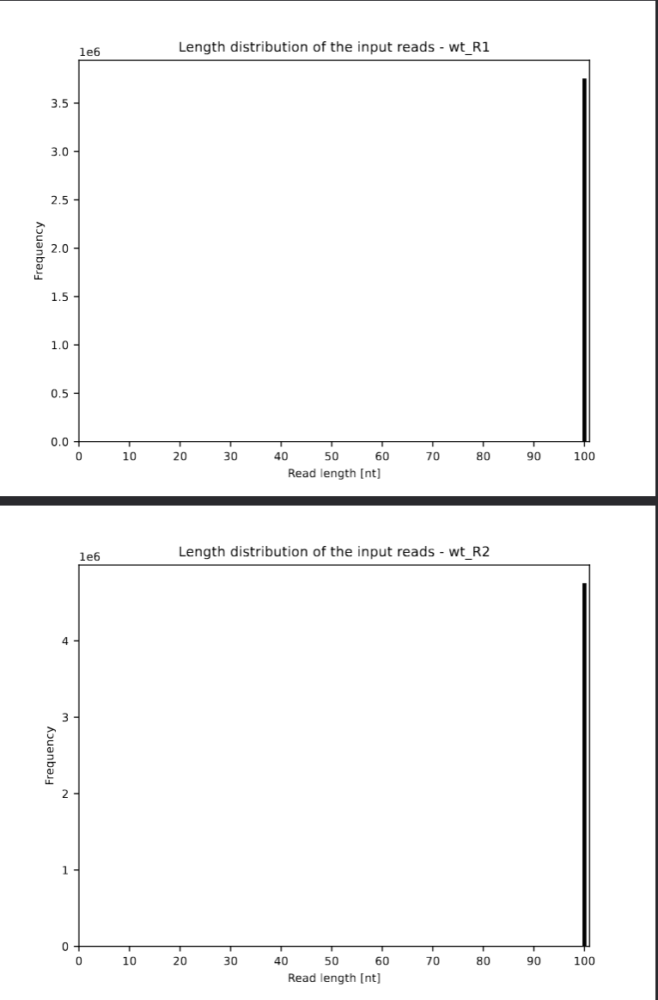
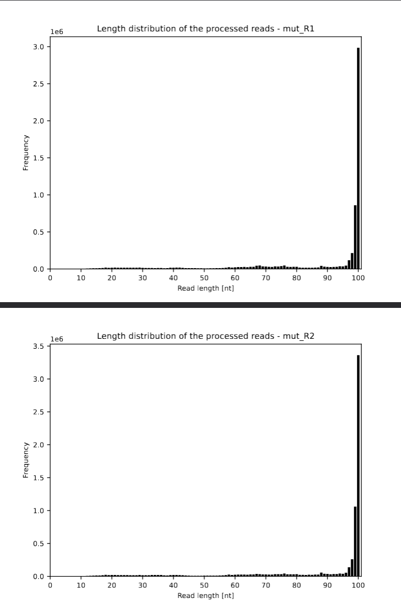
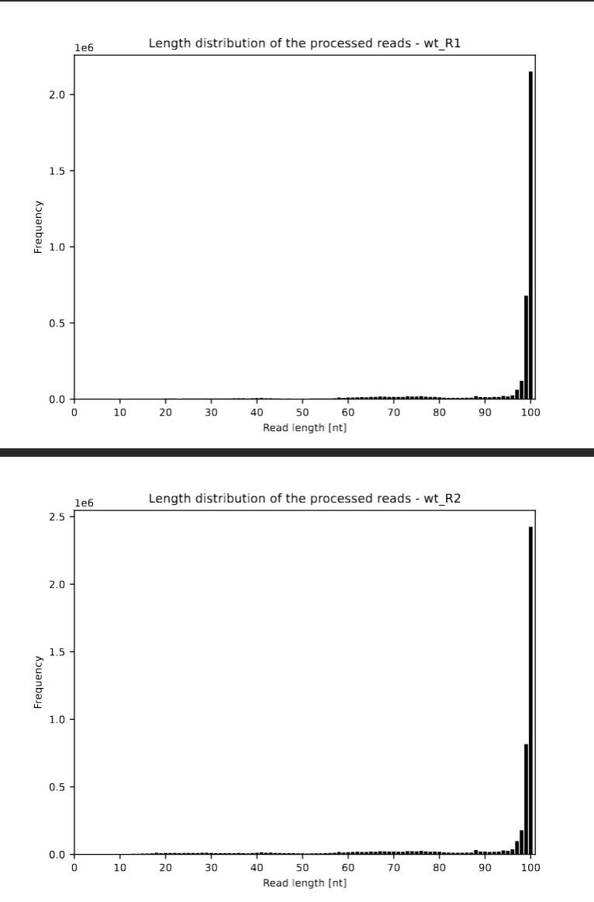

What I did today:

- Created my folders and downloaded reference sequence files:

```

reademption create --project_path READemption_analysis_1 --species salmonella="Salmonella Typhimurium"

```

```

FTP_SOURCE=ftp://ftp.ncbi.nih.gov/genomes/archive/old_refseq/Bacteria/Salmonella_enterica_serovar_Typhimurium_SL1344_uid86645/
wget -O READemption_analysis/input/salmonella_reference_sequences/NC_016810.fa $FTP_SOURCE/NC_016810.fna
wget -O READemption_analysis/input/salmonella_reference_sequences/NC_017718.fa $FTP_SOURCE/NC_017718.fna
wget -O READemption_analysis/input/salmonella_reference_sequences/NC_017719.fa $FTP_SOURCE/NC_017719.fna
wget -O READemption_analysis/input/salmonella_reference_sequences/NC_017720.fa $FTP_SOURCE/NC_017720.fna

```


-Then renamed the files similar to the genome naming: 

```
sed -i "s/>/>NC_016810.1 /" READemption_analysis_1/input/salmonella_reference_sequences/NC_016810.fa
sed -i "s/>/>NC_017718.1 /" READemption_analysis_1/input/salmonella_reference_sequences/NC_017718.fa
sed -i "s/>/>NC_017719.1 /" READemption_analysis_1/input/salmonella_reference_sequences/NC_017719.fa
sed -i "s/>/>NC_017720.1 /" READemption_analysis_1/input/salmonella_reference_sequences/NC_017720.fa

```

-Download gene annotations and unzip it:

```
wget -O READemption_analysis_1/input/salmonella_annotations/GCF_000210855.2_ASM21085v2_genomic.gff.gz https://ftp.ncbi.nlm.nih.gov/genomes/all/GCF/000/210/855/GCF_000210855.2_ASM21085v2/GCF_000210855.2_ASM21085v2_genomic.gff.gz
gunzip READemption_analysis_1/input/salmonella_annotations/GCF_000210855.2_ASM21085v2_genomic.gff.gz

```

- Download RNA-seq reads

```

wget -O READemption_analysis_1/input/reads/InSPI2_R1.fa.bz2 http://reademptiondata.imib-zinf.net/InSPI2_R1.fa.bz2
wget -O READemption_analysis_1/input/reads/InSPI2_R2.fa.bz2 http://reademptiondata.imib-zinf.net/InSPI2_R2.fa.bz2
wget -O READemption_analysis_1/input/reads/LSP_R1.fa.bz2 http://reademptiondata.imib-zinf.net/LSP_R1.fa.bz2
wget -O READemption_analysis_1/input/reads/LSP_R2.fa.bz2 http://reademptiondata.imib-zinf.net/LSP_R2.fa.bz2

```

-Then aligned reads to reference

```

reademption align -p 4 --poly_a_clipping --project_path READemption_analysis_1

```

-Calculating read coverage

```

reademption coverage -p 4 --project_path READemption_analysis_1

```

-Quantify gene expression

```

reademption gene_quanti -p 4 --features CDS,tRNA,rRNA --project_path READemption_analysis_1

```

-Calculate differential expression using DESeq2

```

reademption deseq -l InSPI2_R1.fa.bz2,InSPI2_R2.fa.bz2,LSP_R1.fa.bz2,LSP_R2.fa.bz2 -c InSPI2,InSPI2,LSP,LSP -r 1,2,1,2 --libs_by_species salmonella=InSPI2_R1,InSPI2_R2,LSP_R1,LSP_R2 --project_path READemption_analysis_1

```

Finally, the results were visualized to interpretation of the alignment quality and expression:

```

reademption viz_align --project_path READemption_analysis_1
reademption viz_gene_quanti --project_path READemption_analysis_1
reademption viz_deseq --project_path READemption_analysis_1

```

## Example2

- Download the sequence data for analysis

-First we need to download the data using grabseqs, a tool that allows us downloading of sequence data from various repositories.

```

grabseqs sra -t 4 -m ./metadata.csv SRR4018514
grabseqs sra -t 4 -m ./metadata.csv SRR4018515
grabseqs sra -t 4 -m ./metadata.csv SRR4018516
grabseqs sra -t 4 -m ./metadata.csv SRR4018517

```

-Rename each file according to the sample names 

- create the redemption folder structure

```

reademption create --project_path READemption_analysis_2 --species methanosarcina="Methanosarcina mazei Gö1"

```

- Download the reference genome and annotation files

```

wget -O READemption_analysis_2/input/methanosarcina_reference_sequences/GCF_000007065.1_ASM706v1_genomic.fna.gz https://ftp.ncbi.nlm.nih.gov/genomes/all/GCF/000/007/065/GCF_000007065.1_ASM706v1/GCF_000007065.1_ASM706v1_genomic.fna.gz

```

```

wget -O READemption_analysis_2/input/methanosarcina_annotations/GCF_000007065.1_ASM706v1_genomic.gff.gz https://ftp.ncbi.nlm.nih.gov/genomes/all/GCF/000/007/065/GCF_000007065.1_ASM706v1/GCF_000007065.1_ASM706v1_genomic.gff.gz

```

-unzip them

```


gunzip READemption_analysis_2/input/methanosarcina_reference_sequences/GCF_000007065.1_ASM706v1_genomic.fna.gz
gunzip READemption_analysis_2/input/methanosarcina_annotations/GCF_000007065.1_ASM706v1_genomic.gff.gz

```

- Run READemption

-Align reads to reference

```

reademption align -p 4 --poly_a_clipping --project_path READemption_analysis_2 --fastq

```

-Then calculate read coverage

```

reademption coverage -p 4 --project_path READemption_analysis_2

```

- Quantify Gene expression

```

reademption gene_quanti -p 4 --features CDS,tRNA,rRNA --project_path READemption_analysis_2

```

- Calculate differential expression using DESeq2

```

reademption deseq -l mut_R1.fastq.gz,mut_R2.fastq.gz,wt_R1.fastq.gz,wt_R2.fastq.gz -c mut,mut,wt,wt -r 1,2,1,2 --libs_by_species methanosarcina=mut_R1,mut_R2,wt_R1,wt_R2 --project_path READemption_analysis_2

```

- Visualization

```

reademption viz_align --project_path READemption_analysis_2
reademption viz_gene_quanti --project_path READemption_analysis_2
reademption viz_deseq --project_path READemption_analysis_2

```

## Analysing the results

- all_species_viz_align


Most reads in all samples mapped uniquely to Methanosarcina mazei, while only a few reads were unmapped. Cross-aligned reads were almost not present. This indicates that the alignment worked well and the data quality is good.

- methanosarcina_viz_align


The alignment plot shows that most reads in all samples were uniquely mapped to the reference genome, indicating high mapping quality. Only a small fraction of reads were mapped to multiple locations, and split or cross-aligned reads were nearly absent. Overall, the results suggest reliable and specific read alignment.

- methanosarcina_viz_deseq

MA Plot:


The MA plot compares gene expression between the mutant and wild type samples. Each point represents one gene. Most genes are located around log2 fold change = 0, which means their expression levels are similar in both conditions. However, some genes (shown in red) are significantly up- or down-regulated. Overall, the plot suggests that only a subset of genes shows clear differential expression.

Volcano Plot


The volcano plot visualizes differential gene expression between mutant and wild type samples. The x-axis shows the log2 fold change, while the y-axis represents the −log10 adjusted p-value. Genes that appear higher on the plot are more statistically significant, and genes farther from zero show stronger expression changes. In our data, most genes cluster near the center and below the significance threshold, indicating no major change in expression. However, a smaller number of genes pass the thresholds and are significantly up- or down-regulated.

- methanosarciana_viz_gene_quanti







The expression scatter plots compare gene expression levels between different conditions. Ideally, most genes should show similar expression, so the data points are expected to lie close to the diagonal line and the correlation (R) value should be near 1. In our case, most points indeed follow the diagonal, indicating overall similar expression patterns. However, a few points deviate from the line, suggesting that some genes are differentially expressed between the conditions. Overall, the R values being close to 1 indicate good agreement between the samples.

- RNA Class sizes


the RNA class size plot shows the distribution of reads across different RNA types in each sample. In all samples, CDS-associated reads represent the largest fraction, while rRNA and tRNA reads are present at lower levels. Importantly, the overall pattern is consistent between samples, suggesting no strong bias toward a specific RNA class in any single sample.

- read_lengths_viz_align










Before trimming, almost all reads had a length of 100 nt. After trimming, the read lengths became more variable, but most reads still remained close to 100 nt. This suggests that trimming removed only a small number of low-quality bases.

## What Now?

The most important files for further analysis lie in the methanosarcina_deseq folder. Here you can find the tables that show the results of the differential expression analysis (log2 FC, p-values etc.), for both the raw data (deseq_raw) and with annotations (deseq_with_annotations). The annotations are crucial, because without them we don't know which genes are actually differentially expressed.

Think about what you could do with these results.

-Using the DESeq output, we can detect which genes are significantly up- or down-regulated between the conditions. When the annotated tables are included, it becomes possible to understand the biological meaning of these changes, since the genes can be linked to their known functions. This makes it easier to group differentially expressed genes into functional categories or pathways and to perform enrichment analyses. In this way, the statistical results (such as log2 fold change and p-values) can be translated into biological insight about how Methanosarcina adapts to the tested condition.